## Part 1. Инструмент ipcalc
* ### 1.1. Сети и маски
    * Адрес сети 192.167.38.54/13 - 192.160.0.0
    * Перевод маски 255.255.255.0:
        * в префиксную: /24
        * двоичную запись: 11111111.11111111.11111111.00000000 
    * /15:
        * в обычную: 255.254.0.0
        * двоичную: 11111111.11111110.00000000.00000000
    * 11111111.11111111.11111111.11110000:
        * в обычную: 255.255.255.240
        * префиксную: /28
    
    * Минимальный и максимальный хост в сети 12.167.38.4 при масках: 
        * /8 - 12.0.0.1 и 12.255.255.254
        * 11111111.11111111.00000000.00000000 - 12.167.0.1 и 12.167.255.254
        * 255.255.254.0 - 12.167.38.1 и 12.167.39.254
        * /4 - 0.0.0.1 и 15.255.255.254

* ### 1.2. localhost

    * Определить и записать в отчёт, можно ли обратиться к приложению, работающему на localhost, со следующими IP: 
    194.34.23.100 - NO
    127.0.0.2 - YES
    127.1.0.1 - YES
    128.0.0.1 - NO

* ### 1.3. Диапазоны и сегменты сетей
    * Какие из перечисленных IP можно использовать в качестве публичного, а какие только в качестве частных: 
    10.0.0.45 - private
    134.43.0.2 - public
    192.168.4.2 - private
    172.20.250.4 - private
    172.0.2.1 - public
    192.172.0.1 - public 
    172.68.0.2 - public
    172.16.255.255 - private 
    10.10.10.10 - private
    192.169.168.1 - public

    There are classifications of IP addresses as "private" and "public". The following ranges of addresses are reserved for private (aka LAN) networks:
    10.0.0.0 — 10.255.255.255 (10.0.0.0/8),
    172.16.0.0 — 172.31.255.255 (172.16.0.0/12),
    192.168.0.0 — 192.168.255.255 (192.168.0.0/16).
    127.0.0.0 — 127.255.255.255 (Reserved for loopback interfaces (not used for communication between network nodes), so called localhost).

    * Какие из перечисленных IP адресов шлюза возможны у сети 10.10.0.0/18: 
    10.0.0.1 - NO
    10.10.0.2 - YES
    10.10.10.10 - YES
    10.10.100.1 - NO
    10.10.1.255 - YES

## Part 2. Статическая маршрутизация между двумя машинами
* Поднять две виртуальные машины (далее -- ws1 и ws2.
С помощью команды __ip a__ посмотреть существующие сетевые интерфейсы:
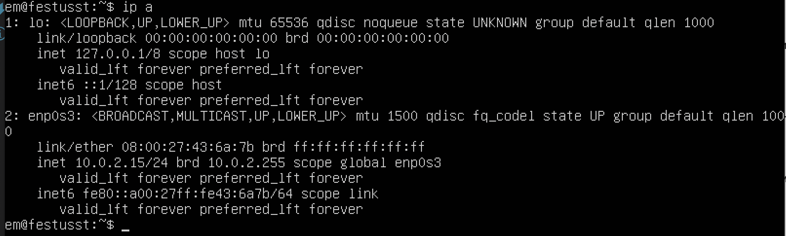
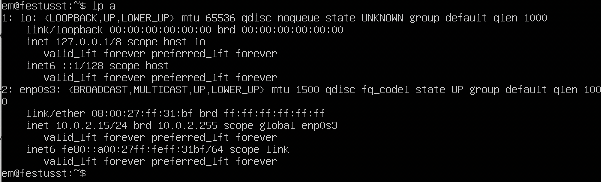

 * Описать сетевой интерфейс, соответствующий внутренней сети, на обеих машинах и задать следующие адреса и маски: ws1 - 192.168.100.10, маска /16, ws2 - 172.24.116.8, маска /12
В отчёт поместить скрины с содержанием изменённого файла etc/netplan/00-installer-config.yaml для каждой машины.
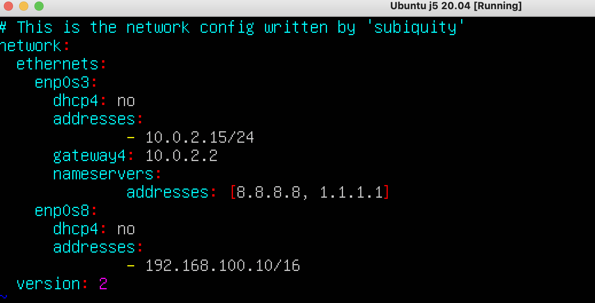
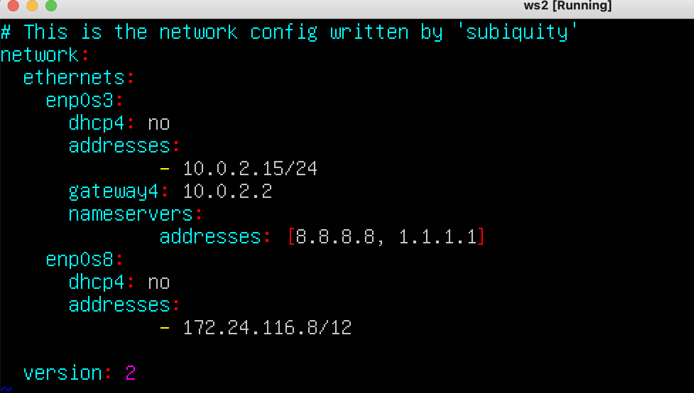

* Выполнить команду netplan apply для перезапуска сервиса сети. В отчёт поместить скрин с вызовом и выводом использованной команды.

* 2.1. Добавление статического маршрута вручную
Добавить статический маршрут от одной машины до другой и обратно при помощи команды вида ip r add.
Пропинговать соединение между машинами:

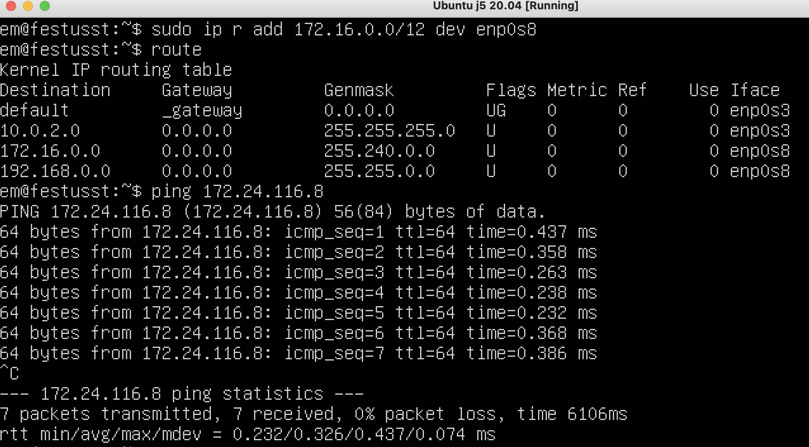 

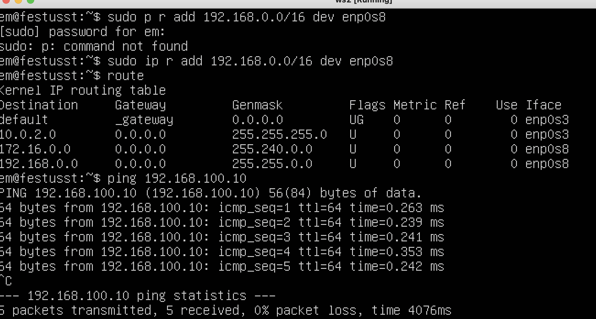

### 2.2. Добавление статического маршрута с сохранением

Перезапустить машины. Добавить статический маршрут от одной машины до другой с помощью файла etc/netplan/00-installer-config.yaml
В отчёт поместить скрин с содержанием изменённого файла etc/netplan/00-installer-config.yaml:

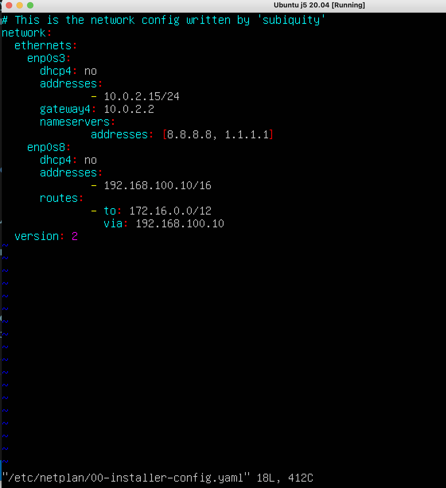

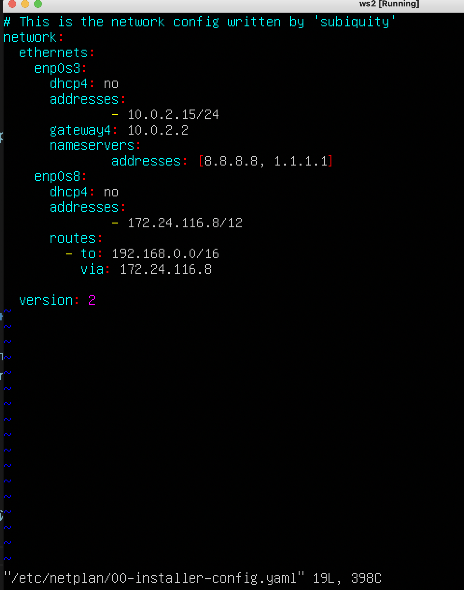 

Пропинговать соединение между машинами. В отчёт поместить скрин с вызовом и выводом использованной команды:

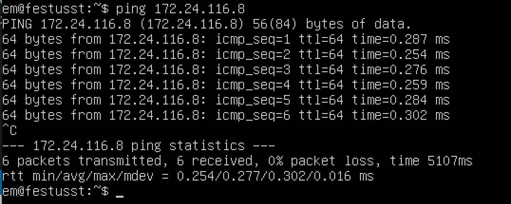

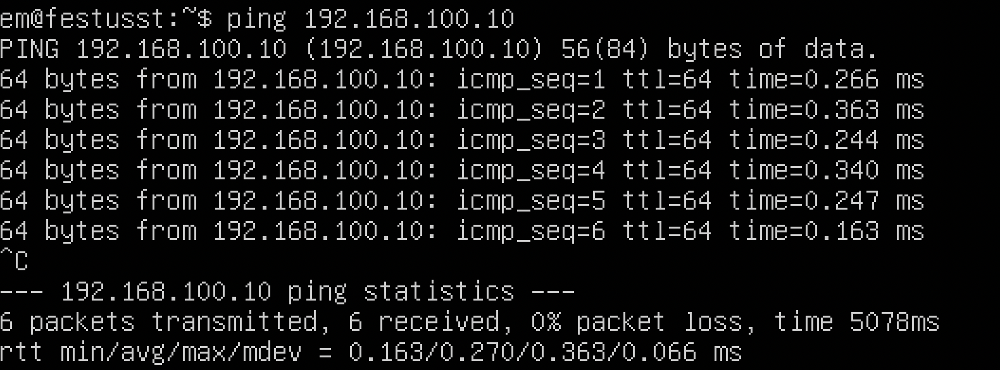

## Part 3. Утилита iperf3
* ### 3.1. Скорость соединения
Перевести и записать в отчёт: 
8 Mbps - 1 MB/s
100 MB/s - 800000 Kbps
1 Gbps - 1000 Mbps

* ### 3.2. Утилита iperf3
Измерить скорость соединения между ws1 и ws2. В отчёт поместить скрины с вызовом и выводом использованных команд.
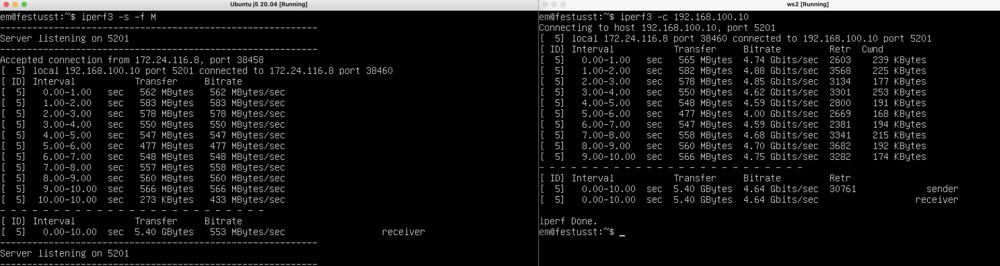

## Part 4. Сетевой экран
* В отчёт поместить скрины с содержанием файла /etc/firewall для каждой машины.

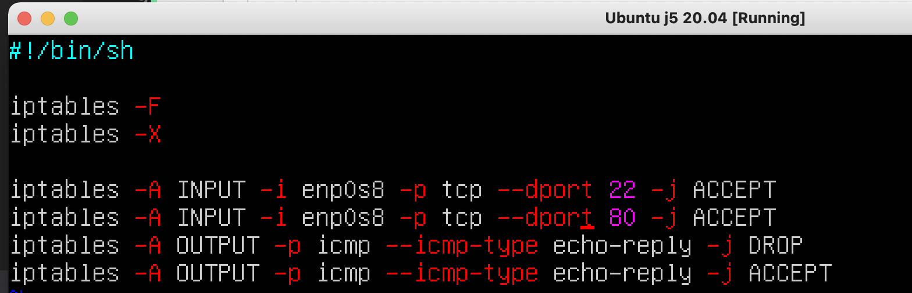

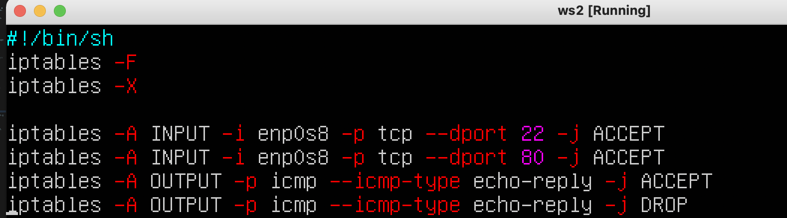

* В отчёт поместить скрины с запуском обоих файлов. 

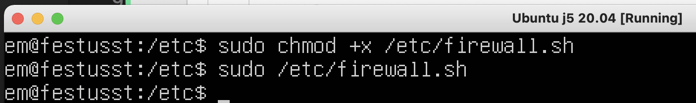

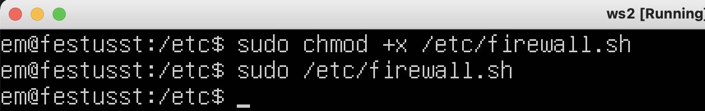

* В отчёте описать разницу между стратегиями, применёнными в первом и втором файлах:

Действия для таблицы FILTER являются терминальными, т.е. прекращают прохождение пакета по цепочке.
В первом случае сработает правило DROP и дальше пакет не пойдет, во втором наоборот.

### 4.2. Утилита nmap

Командой ping найти машину, которая не "пингуется", после чего утилитой nmap показать, что хост машины запущен:

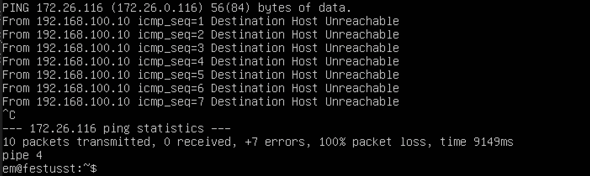

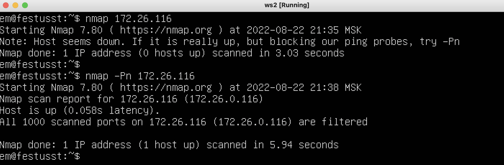

## Part 5. Статическая маршрутизация сети

